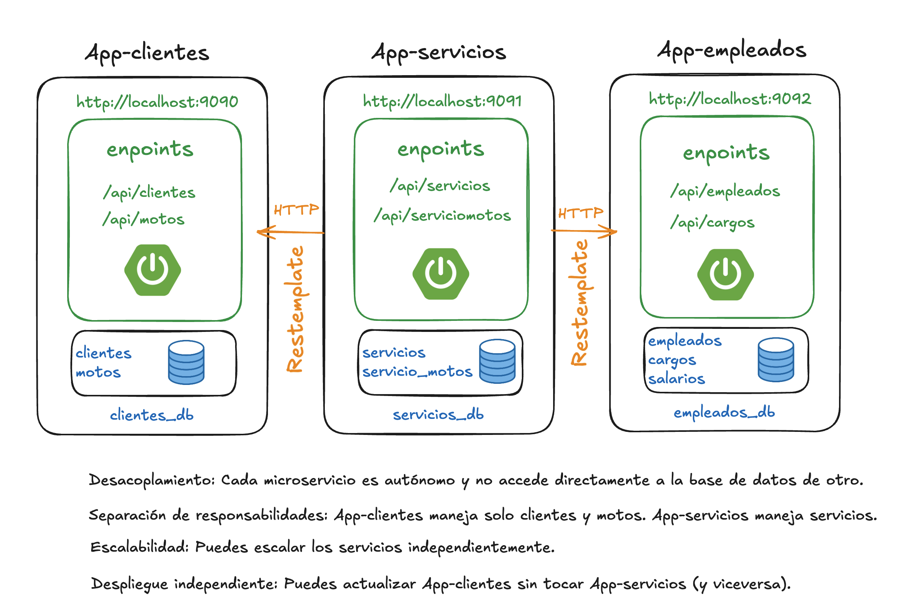
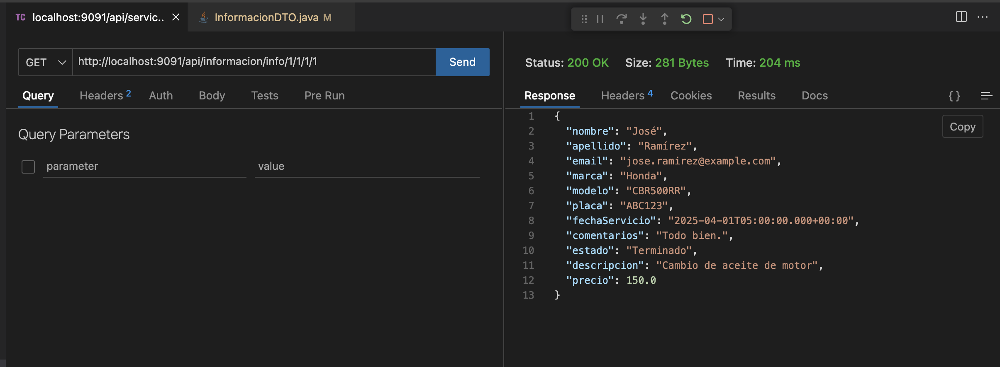

# Arquitectura microservicios

**App-servicios** Consume información mediante peticiones HTTP de **App-clientes** consultado información de **clientes** y **motos**. También consume información de **App-empleados** consultado información de **empleados** y **cargos**.

## App-servicios

- **@Getter y @Setter** Genera automáticamente los métodos get y set para todos los atributos.
- **@Builder** Permite construir objetos usando el patrón builder (Servicio.builder().nombre("...").build()).
- **@NoArgsConstructor** Genera un constructor sin parámetros.
- **@AllArgsConstructor** Genera un constructor con todos los atributos como parámetros.

- **@Id** Define que este campo es la clave primaria de la tabla.
- **@GeneratedValue(strategy = GenerationType.IDENTITY)** Indica que el valor de id será generado automáticamente por la base de datos, usando auto-incremento.

## Evidencia
